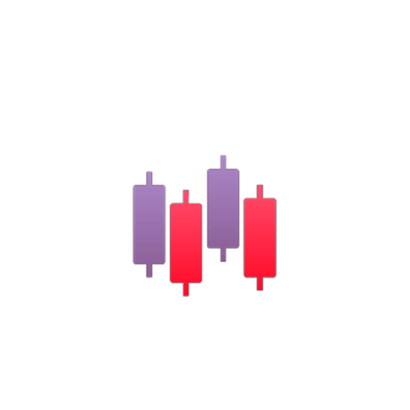

# *PaperTrader*

## Product Logo 

## Project Concept

[Project Concept](concept.md)

## Scope

The scope of the project is to provide users with the ability to manage an investment portfolio without using real money. Features such as: tailoring the porfolio to that person, providing a portfolio analysis to the user, financial information displayed to the user, are the main focus of the website. A REST API could be developed from this website that could show what people are willing to invest in. 

## Vision

A robust investment platform that is tailored to the user. The website will allow users to gain a senese of financial literacy to use when investing in their own portfolio. The vision is to provide individuals with portfolio management and investment experience to eventually gain financial indipendence. 

## Description

PaperTrader is a paper trading web application for users to practice trading stocks without spending any money. The application is focused on tailoring the portfolio management experience toward the user by providing: individualized stock recommendations, and portfolio analysis. 

## Prerequisites

Nothing is required to run PaperTrader as it is a website.

## Requirements

[Requirements](requirements.md)

## Design

[Design](design.md)

## Test Plan

[Test Plan doc](test.plan.md)

## Built With

- [Spring Boot 2.7.3](https://spring.io): Java MVC web framework, backend
- [Angular](https://angular.io): Front end framework.
- IntelliJ, WebStorm

## Author

- **Joey Martin**: *PaperTrader* 
- [LinkedIn](www.linkedin.com/in/joey-martin-8727641a1) 
- [GitHub](https://github.com/martinj2-dot)
 
### About

The vision for this website was to bring about an easily accessible way for everyone to learn about portfolio management and managing their own finances. I have always had an interest in learning how the stock market market operates in order to gain financial independence. Since the focus of this is to teach and allow users to learn freely, my objective is to bring a wealth of information and learning to as many users as possible.  

## Acknowledgments

- If you find code that you are going to use in YourProjectName, include author's name and URL here.
- Scott Heggen and Brian Ramsay for inspiring a passion for programming.
- Zach Neill for his knowledge of Spring and Angular web development help.

## Licenses 
[Logo License](/Files/license.pdf)

<a href="https://www.flaticon.com/free-icons/stocks" title="stocks icons">Stocks icons created by andinur - Flaticon</a>

<a href="https://www.flaticon.com/free-icons/dm" title="dm icons">Dm icons created by Maan Icons - Flaticon</a>
## Links

[Concept](concept.md)
